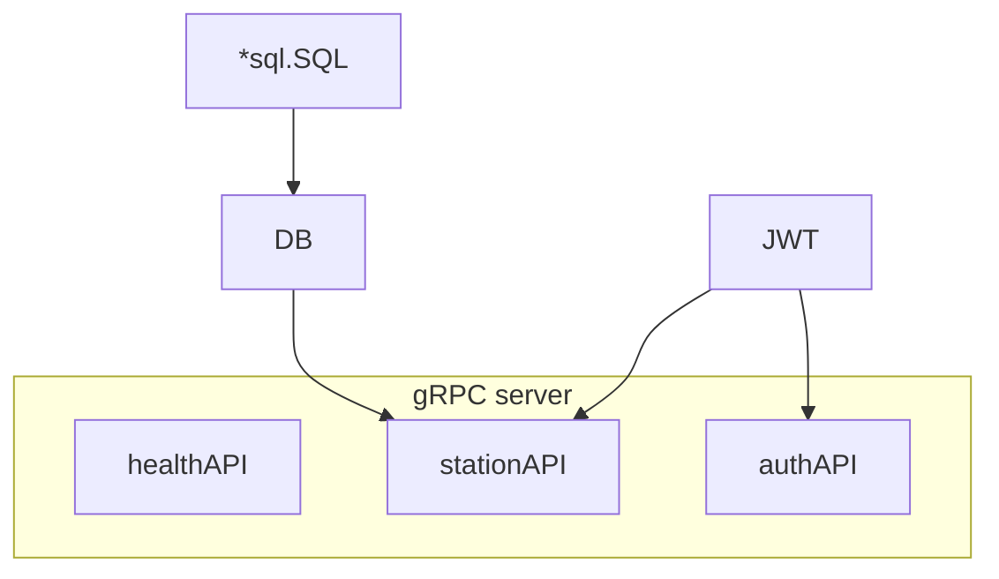
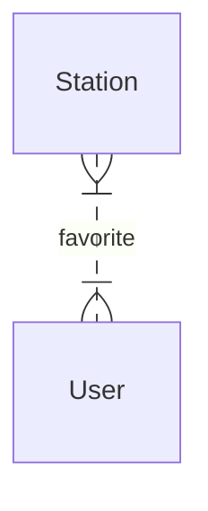
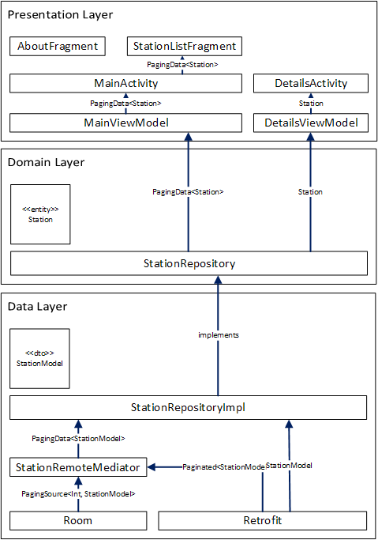

# Train Station

By Marc Nguyen and Jean-Baptiste Rubio.

## Specifications

### API

Specifications are given here: [Protos](./protos) and [`docs`](./docs)

### Android

- Fetch data from the api and display in a list and a screen with the details

- Possibility to bookmark certain items per user

- OAuth Authentication

- Mockup:

  

- Implementation of a search/filter system on the displayed list

- Setting up a local database to display the item list in offline mode

- Usage of StateFlow

## Screenshots

   

# Modern Android Development (MAD)

[MAD scorecard](https://madscorecard.withgoogle.com/scorecard/share/4258311558/)


# Documentation

## API

### Setup

#### Production build and deployment

Use docker/kubernetes/openshift to deploy the container.

```sh
docker pull ghcr.io/darkness4/train-station-api:latest
```

Available arch are: `arm64` and `amd64`.

An example of docker-compose.yml:

```sh
version: '3.9'
services:
  train-station-api:
    build: ghcr.io/darkness4/train-station-api:amd64
    ports:
      - 3000:3000
    volumes:
      - ./db:/db
    environment:
      JWT_SECRET: <base64 secret>
      LISTEN_ADDRESS: 0.0.0.0:3000
      DB_PATH: /db/db.sqlite3
      DEBUG: true
      TLS_ENABLE: false
```

#### Setup a development environment

1. Install [golang](https://golang.org) et install the dependencies

   ```sh
   go mod download
   ```

4. ```sh
   # Inside: ./train-station-api
   make
   ./bin/train-station-api
   make unit # Run unit tests
   ```

### Architecture



If you have seen the old versions before version 2, we were using the SOLID architecture in Go. After years of experience, we realized that the SOLID architecture tells us how to organize our code and how to inject dependencies.

However, the explicit layering adds standard code and incomprehensible "data mappings", which hinders maintainability and understanding of the project. While the SOLID architecture seems ideal for object-oriented languages such as Kotlin, for Go it adds too much boilerplate code with no benefit other than having to "pseudo-satisfy" the SOLID principles.

In reality, the SOLID priciples goes against the [Effective Go](https://go.dev/doc/effective_go) recommendations which is way more important since it is the base for every Go developers, while SOLID are principles for object-oriented programming.

Since SOLID offers no real benefits outside of pain, we decided to remove the explicit layering while still sticking to domain-oriented development.

The contract is as follows:

- Retrieve the data at the start of the program
- Retrieve stations (several or one)
- The user can add a station to his favorites

This translates into :

- Download the data in the `main.go` as the `main` function indicates the start. The data is stored in a database or cache.
- The gRPC models are the domain entities and we serve them. This means that we translate the database models into gRPC models.
- Define a `favoriteSetter` interface and implement it. And the database can implement the interface perfectly.

### Entity relationship




### Technologies used

- SQLBoiler for database-first approach 
- go-migrate for database migrations
- gRPC as HTTP server and main entrypoint
- urfave/cli for the CLI tooling
- JWT for session handling
- OAuth2 for Authentication

## Android App

### Architecture



The **Data** layer:

- The Data layer runs under Kotlin Coroutines and Kotlin Flow.
- _Room_ is the application's cache
  - The cache temporarily stores the `StationModel`
  - The cache is observable using Kotlin Flow
  - _Room_ is able to provide a [`PagingSource`](https://developer.android.com/reference/kotlin/androidx/paging/PagingSource). The `PagingSource` is able to load pages of data stored in a [`PagingData`](https://developer.android.com/reference/kotlin/androidx/paging/PagingData).
  - _Room_ executes requests in a Kotlin coroutine in the [IO thread](https://kotlin.github.io/kotlinx.coroutines/kotlinx-coroutines-core/kotlinx.coroutines/-dispatchers/-i-o.html).
- _Retrofit_ is the HTTP client
  - The HTTP client provides `Paginated<StationModel>` (a `List<StationModel>` per page).
  - The HTTP client executes requests in a Kotlin coroutine
- `StationRemoteMediator` loads pages from the cache or from HTTP responses depending on connectivity.
  - The logic can be summarised as follows:
    - It loads the next/previous/initial page by making an HTTP request
    - It **caches the `StationModel` of the HTTP response**.
    - It implements [`RemoteMediator`](https://developer.android.com/reference/kotlin/androidx/paging/RemoteMediator), mediating between the local and remote source.
- The `StationRepositoryImpl` implements `StationRepository` and executes CRUD methods.
  - For asynchronous actions, the `StationModel` of the response is cached and returned.
  - For a watch action (`watch`/`watchOne`), we observe the cache directly **without making an HTTP request**.
  - For paged data, we create and run the [`Pager`](https://developer.android.com/reference/kotlin/androidx/paging/Pager) to **retrieve the `PagingData` from the cache.** Depending on whether we consume the `PagingData<Station>` stream, `Pager` will contact `StationRemoteMediator` to load more page data.
  - The `StationModel` data is transformed into a `Station` (entity). We thus separate the responsibilities between models and entities.

In the **Domain** layer:

- Entities and business code are defined here.
- Currently, our `stationRepository` satisfies most use cases (displaying a list of `Stations`, displaying details of a `Station`, updating a `Station`...).
- We add the `toggleFavorite` method to the `Station` entity.

Dans la couche **Presentation** :

- Data is observable in the `ViewModel` as [`StateFlow`](https://developer.android.com/kotlin/flow/stateflow-and-sharedflow)
- In the main page:
  - The `MainActivity` contains a `ViewPager2` and a `TabLayout`. The `ViewPager2` displays the `Fragments`. The `TabLayout` is the top banner displaying the page (see mockup.). The link between the two is provided by a `TabLayoutMediator`.
  - In the `StationListFragment`, the `RecyclerView` displaying the stations has 2 adapters.
    - The `StationsAdapter` which implements the `PagingDataAdapter` and displays the paged `PagingData<Station>` in the `RecyclerView`.
    - `StationLoadStateAdapter` which implements the `LoadStateAdapter` and allows pages to load (or displays page load errors)
  - The `MainViewModel` (ViewModel of the main page):
    - observes user actions ("load details page", "manually refresh page" and "bookmark or not")
    - exposes the `Flow<PagingData<Station>>` observable so that it can be stored in the `StationsAdapter` (with the `stationsAdapter.submitData` method)
  - The `AuthViewModel`:
    - allows user to login. Since, the View Model is scoped to the `MainActivity` the user session is stored.
- In the details page:
  - There is a Google Maps that displays the position of the train station
  - `DetailsViewModel` loads the station details and exposes an obersable `StateFlow<Station>`
- In both pages:
  - The result of an **asynchronous** action is observable as `networkStatus: StateFlow<Result<Unit>`. Depending on the result, a [_Toast_](https://developer.android.com/guide/topics/ui/notifiers/toasts) will be displayed if an error occurs.

### Technologies used

#### Android dependencies and AndroidX

- Room, as a cache
- Retrofit + OkHttp 4, as an HTTP client
- Data Binding, for bidirectional data and view binding
- ViewModel and StateFlow, to do MVVM and avoid fragment/activities lifecycle issues
- ViewPager 2, as a horizontal navigation host
- Paging 3, as a solution for paged data
- Android KTX, for Kotlin extensions, helping to use certain dependencies
- Hilt, for dependency injection
- Google Maps SDK for Android
- Firebase Auth for authentication

#### Kotlin in general

- Kotlin Coroutines + Kotlin Flow, pour l'asynchrone
- Kotlinx.serialization, pour la serialisation en JSON

### References

#### Codelabs

- [Kotlin Android Fundamentals](https://developer.android.com/courses/kotlin-android-fundamentals/overview)
- [Android Paging](https://developer.android.com/codelabs/android-paging)
- [Use Kotlin Coroutines in your Android App](https://developer.android.com/codelabs/kotlin-coroutines)

#### Documentations

- [Android KTX](https://developer.android.com/kotlin/ktx)
- [Data Binding](https://developer.android.com/topic/libraries/data-binding)
- [StateFlow](https://developer.android.com/kotlin/flow/stateflow-and-sharedflow)
- [Guide to App Architecture](https://developer.android.com/jetpack/guide)
- [Android Hilt](https://developer.android.com/training/dependency-injection/hilt-android) / [Dagger Hilt](https://dagger.dev/hilt/)
- [Kotlin Coroutines](https://kotlinlang.org/docs/reference/coroutines-overview.html)
- [Google Maps SDK for Android](https://developers.google.com/maps/documentation/android-sdk/overview)
- [Create swipe views with tabs using ViewPager2](https://developer.android.com/guide/navigation/navigation-swipe-view-2)
- [Paging 3 Overview](https://developer.android.com/topic/libraries/architecture/paging/v3-overview)

# LICENSE

```
MIT License

Copyright (c) 2021 Marc NGUYEN, Jean-Baptiste RUBIO

Permission is hereby granted, free of charge, to any person obtaining a copy
of this software and associated documentation files (the "Software"), to deal
in the Software without restriction, including without limitation the rights
to use, copy, modify, merge, publish, distribute, sublicense, and/or sell
copies of the Software, and to permit persons to whom the Software is
furnished to do so, subject to the following conditions:

The above copyright notice and this permission notice shall be included in all
copies or substantial portions of the Software.

THE SOFTWARE IS PROVIDED "AS IS", WITHOUT WARRANTY OF ANY KIND, EXPRESS OR
IMPLIED, INCLUDING BUT NOT LIMITED TO THE WARRANTIES OF MERCHANTABILITY,
FITNESS FOR A PARTICULAR PURPOSE AND NONINFRINGEMENT. IN NO EVENT SHALL THE
AUTHORS OR COPYRIGHT HOLDERS BE LIABLE FOR ANY CLAIM, DAMAGES OR OTHER
LIABILITY, WHETHER IN AN ACTION OF CONTRACT, TORT OR OTHERWISE, ARISING FROM,
OUT OF OR IN CONNECTION WITH THE SOFTWARE OR THE USE OR OTHER DEALINGS IN THE
SOFTWARE.
```
