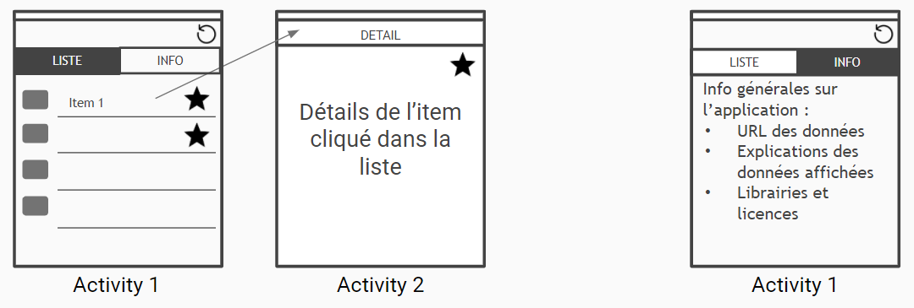
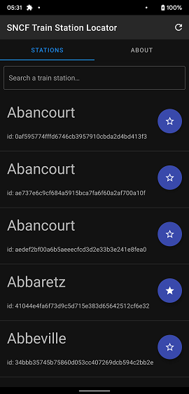
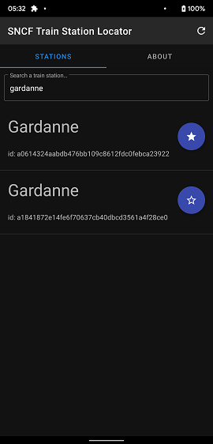
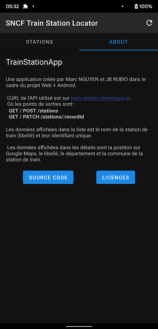
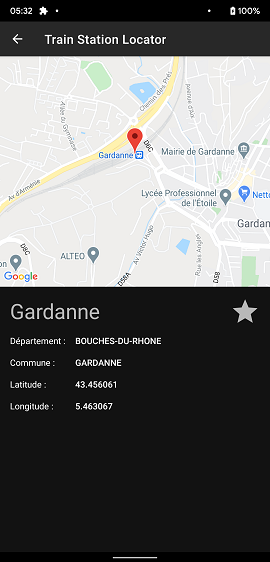
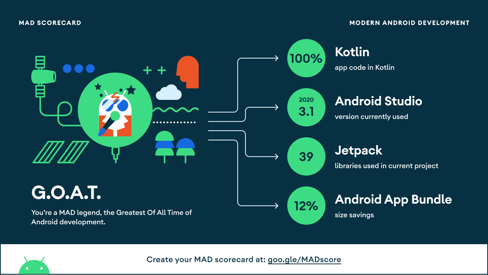
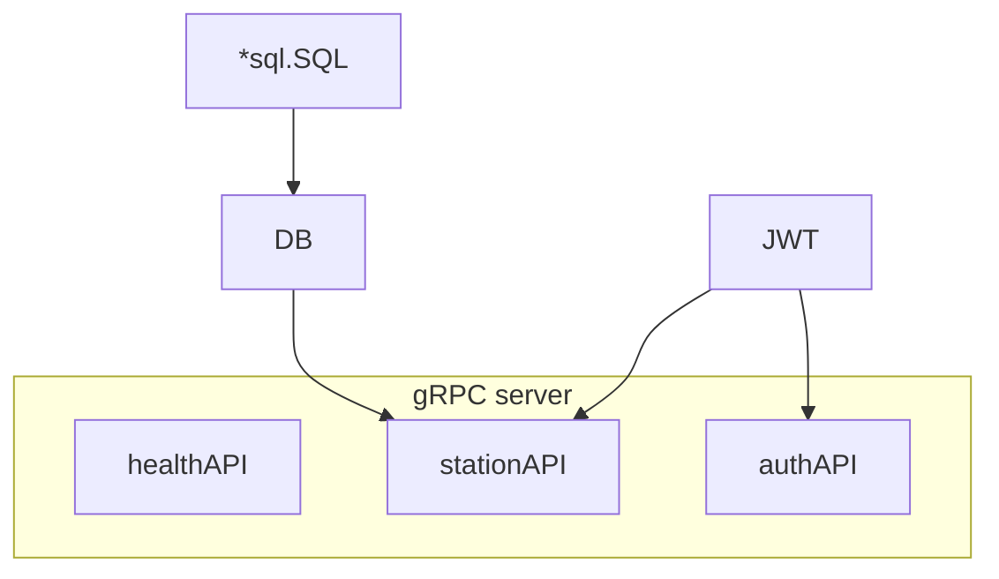
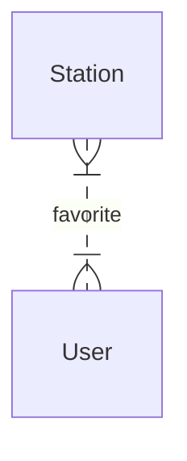
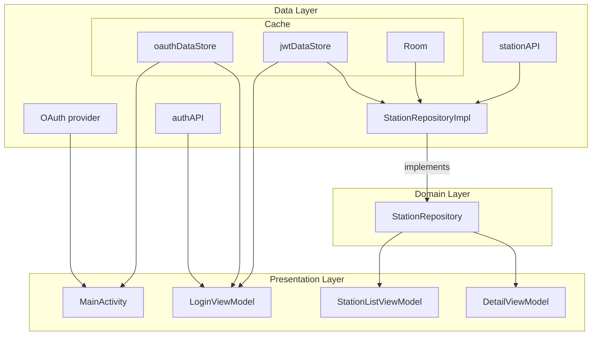

# Train Station

By Marc Nguyen and Jean-Baptiste Rubio.

## Specifications

### API

Specifications are given here: [Protos](./protos) and [`docs`](./docs)

### Android

- Fetch data from the api and display in a list and a screen with the details

- Possibility to bookmark certain items per user

- OAuth Authentication

- Mockup:

  

- Implementation of a search/filter system on the displayed list

- Setting up a local database to display the item list in offline mode

- Usage of StateFlow

## Screenshots

   

# Modern Android Development (MAD)

[MAD scorecard](https://madscorecard.withgoogle.com/scorecard/share/4258311558/)



# Documentation

## API

### Setup

#### Production build and deployment

Use docker/kubernetes/openshift to deploy the container.

```sh
docker pull ghcr.io/darkness4/train-station-api:latest
```

Available arch are: `arm64` and `amd64`.

An example of docker-compose.yml:

```sh
version: '3.9'
services:
  train-station-api:
    build: ghcr.io/darkness4/train-station-api:amd64
    ports:
      - 3000:3000
    volumes:
      - ./db:/db
    environment:
      JWT_SECRET: <base64 secret>
      LISTEN_ADDRESS: 0.0.0.0:3000
      DB_PATH: /db/db.sqlite3
      DEBUG: true
      TLS_ENABLE: false
```

#### Setup a development environment

1. Install [golang](https://golang.org) et install the dependencies

   ```sh
   go mod download
   ```

2. ```sh
   # Inside: ./train-station-api
   make
   ./bin/train-station-api
   make unit # Run unit tests
   ```

### Architecture



If you have seen the old versions before version 2, we were using the SOLID architecture in Go. After years of experience, we realized that the SOLID architecture tells us how to organize our code and how to inject dependencies.

However, the explicit layering adds standard code and incomprehensible "data mappings", which hinders maintainability and understanding of the project. While the SOLID architecture seems ideal for object-oriented languages such as Kotlin, for Go it adds too much boilerplate code with no benefit other than having to "pseudo-satisfy" the SOLID principles.

In reality, the SOLID priciples goes against the [Effective Go](https://go.dev/doc/effective_go) recommendations which is way more important since it is the base for every Go developers, while SOLID are principles for object-oriented programming.

Since SOLID offers no real benefits outside of pain, we decided to remove the explicit layering while still sticking to domain-oriented development.

The contract is as follows:

- Retrieve the data at the start of the program
- Retrieve stations (several or one)
- The user can add a station to his favorites

This translates into :

- Download the data in the `main.go` as the `main` function indicates the start. The data is stored in a database or cache.
- The gRPC models are the domain entities and we serve them. This means that we translate the database models into gRPC models.
- Define a `favoriteSetter` interface and implement it. And the database can implement the interface perfectly.

### Entity relationship



### Technologies used

- sqlc for database-first approach and type-safe SQL
- go-migrate for database migrations
- gRPC as HTTP server and main entrypoint
- urfave/cli for the CLI tooling
- JWT for session handling
- OAuth2 for Authentication

## Web Front-End

### Setup

Install [bun](https://bun.sh) and install the dependencies:

```shell
bun install --frozen-lockfile
```

Create a [Github OAuth App](https://docs.github.com/en/developers/apps/building-oauth-apps/creating-an-oauth-app), generate a secret with `openssl rand -base64 32`, and fill a `.env` file with the following content:

```shell
GITHUB_ID=<Github OAUTH App ID>
GITHUB_SECRET=<Github OAUTH App Secret>
AUTH_SECRET=<Random Secret>
```

Serve in development mode:

```shell
bun run dev
```

Or deploy in production:

```shell
bun run build
# bun run preview # for demonstration
```

### Technologies used

- SvelteKit with SSR as main web framework
- Pure JWT as authentication helpers
- protobuf-ts + gRPC as transport
- ViteJS for bundling and optimizing

## Android App

### Architecture



The **Data** layer:

- The Data layer runs under Kotlin Coroutines and Kotlin Flow.
- _Room_ and the _DataStores_ is the application's cache
  - The cache temporarily stores the `Stations`
  - The cache is observable using Kotlin Flow
  - _Room_ is able to provide a [`PagingSource`](https://developer.android.com/reference/kotlin/androidx/paging/PagingSource). The `PagingSource` is able to load pages of data stored in a [`PagingData`](https://developer.android.com/reference/kotlin/androidx/paging/PagingData).
  - _Room_ executes requests in a Kotlin coroutine in the [IO thread](https://kotlin.github.io/kotlinx.coroutines/kotlinx-coroutines-core/kotlinx.coroutines/-dispatchers/-i-o.html).
- _stationAPI_ is a gRPC data source which permits to retrieves `Stations`. It needs a JWT token to fetch datas.
- _OAuth provider_ gives the OAuth Access Token which is use to authenticate and identify users. The accessToken is cached inside the _oauthDataStore_. Upon receiving the OAuth Access Token, the _authAPI_ tries to fetch a JWT token.
- The `StationRepositoryImpl` implements `StationRepository` and executes CRUD methods.
  - For asynchronous actions, the `Station` of the response is cached and returned.
  - For a watch action (`watch`/`watchOne`), we observe the cache and may fetch the initial values from a data source.
  - For paged data, we create and run the [`Pager`](https://developer.android.com/reference/kotlin/androidx/paging/Pager) to **retrieve the `PagingData` from the cache.** The pager uses the `StationRemoteMediator` which is responsible to fetch and cache pages of `Station` from a data source.

In the **Domain** layer:

- Entities and contracts are defined here.
- Currently, our `stationRepository` satisfies most use cases (displaying a list of `Stations`, displaying details of a `Station`, updating a `Station`...).

In the **Presentation** layer :

- Data is observable in the `ViewModels`. The `ViewModels` act as the middle man between the presentation layer and domain layer. This is to follow the **[Modern Android App Architecture](https://developer.android.com/topic/architecture)**.
- The `MainActivity` renders a `Scaffold` with its `TopAppBar`. Inside that scaffold is a `NavigationHost` composable.
- The `NavigationHost` renders a page based on a route:
  - The default route is `/login`, and shows a login button. The button triggers a redirection to the OAuth provider, which then send the resulting OAuth Access Token to the `MainActivity` and triggers the `authAPI` to fetch a JWT. Upon receiving a JWT, the user is authenticated and is redirected to the `/stations` route.
  - The `/stations` route shows a `LazyColumn` which listen to a `Flow<PagingData<Station>>`. This allows lazy loading of the data, and therefore, the lazy loading of "station cards". The page also shows a "About" page. When the user push on a "station card", the user is redirected to the `/details` route.
  - The `/details` route shows the position of the train station on Google Maps and details about that station on a Bottom Sheet.

### Technologies used

#### Android dependencies and AndroidX

- Room and Protobuf DataStore, as a cache.
- Retrofit + OkHttp 4 + gRPC, as data sources.
- Jetpack Compose, for bidirectional data binding and UI development.
- ViewModel and StateFlow, to follow the Modern Android App Architecture and avoid fragment/activities lifecycle issues
- Paging 3, as a solution for paged data
- Hilt, for dependency injection
- Google Maps SDK for Android

#### Kotlin in general

- Kotlin Coroutines + Kotlin Flow, for async
- Kotlinx.serialization, for JSON serialization

# LICENSE

```
MIT License

Copyright (c) 2021 Marc NGUYEN, Jean-Baptiste RUBIO

Permission is hereby granted, free of charge, to any person obtaining a copy
of this software and associated documentation files (the "Software"), to deal
in the Software without restriction, including without limitation the rights
to use, copy, modify, merge, publish, distribute, sublicense, and/or sell
copies of the Software, and to permit persons to whom the Software is
furnished to do so, subject to the following conditions:

The above copyright notice and this permission notice shall be included in all
copies or substantial portions of the Software.

THE SOFTWARE IS PROVIDED "AS IS", WITHOUT WARRANTY OF ANY KIND, EXPRESS OR
IMPLIED, INCLUDING BUT NOT LIMITED TO THE WARRANTIES OF MERCHANTABILITY,
FITNESS FOR A PARTICULAR PURPOSE AND NONINFRINGEMENT. IN NO EVENT SHALL THE
AUTHORS OR COPYRIGHT HOLDERS BE LIABLE FOR ANY CLAIM, DAMAGES OR OTHER
LIABILITY, WHETHER IN AN ACTION OF CONTRACT, TORT OR OTHERWISE, ARISING FROM,
OUT OF OR IN CONNECTION WITH THE SOFTWARE OR THE USE OR OTHER DEALINGS IN THE
SOFTWARE.
```
