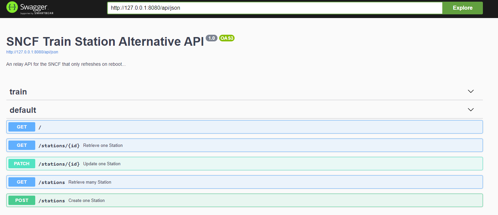

# Train Station

Par Marc NGUYEN et JB Rubio dans le cadre du projet Web + Android 2020.

## Objectifs et Spécifications

### API NestJS

- API REST

- Déployé sur CleverCloud

- GET /stations (Récupérer un résumé de toutes les données (i.e. seulement les infos les plus importantes pour l’affichage dans une liste + favori ou non))

  - Query Params : page : number

  - Exemple :

    - ```json
      {
          "data": [
              {
                  "datasetid":"liste-des-gares",
                  "recordid":"75f37016c5e5900a1f76039bb42d982cb90b93af",
                  "is_favorite":true,
                  "libelle":"Mulhouse-Dornach",
                  "record_timestamp":"2020-07-22T09:29:23.188000+00:00"
              },
              "..."
          ],
          "count": 10,
          "total": 10,
          "page": 10,
          "pageCount": 20,
      }
      ```

- (Bonus) POST /stations (Créer de nouvelles données)

  - Post-data : Station

- GET /stations/:recordid (pour l’affichage dans l’écran de détails)

  - Exemple :

    - ```json
      {
          "datasetid":"liste-des-gares",
          "recordid":"75f37016c5e5900a1f76039bb42d982cb90b93af",
          "is_favorite":true,
          "libelle":"Mulhouse-Dornach",
          "fields":{
              "commune":"MULHOUSE",
              "y_wgs84":47.74689819865143,
              "x_wgs84":7.308132635705053,
              "libelle":"Mulhouse-Dornach",
              "idgaia":"297f12aa-dfbc-11e3-a2ff-01a464e0362d",
              "voyageurs":"O",
              "geo_point_2d":[
                  47.7468981986,
                  7.30813263571
              ],
              "code_ligne":"115000",
              "x_l93":1022672.9941999987,
              "code_uic":"87182055",
              "c_geo":[
                  47.74689819865143,
                  7.308132635705053
              ],
              "rg_troncon":1,
              "geo_shape":{
                  "type":"Point",
                  "coordinates":[
                      7.308132635705054,
                      47.746898198623505
                  ]
              },
              "pk":"105+129",
              "idreseau":5712,
              "departemen":"HAUT-RHIN",
              "y_l93":6747305.211599998,
              "fret":"O"
          },
          "geometry":{
              "type":"Point",
              "coordinates":[
                  7.308132635705053,
                  47.74689819865143
              ]
          },
          "record_timestamp":"2020-07-22T09:29:23.188000+00:00"
      }
      ```

- PATCH /stations/:recordid (Mettre une donnée en favori ou non) (on n'utilisera pas PUT, car contraire aux [normes HTTP](https://tools.ietf.org/html/rfc5789))

  - Post-data (replace): Station(partiel)

- (Bonus) Au lieu de stocker des données dans un fichier JSON, faire une requête au démarrage de l’API pour récupérer les données


## App Android

- Récupération des données de l’api puis affichage dans une liste et un écran avec le détail

- Possibilité de mettre en favori certains éléments

- Maquette :

  

- Application composée au minimum de : 

  - 2 Fragment (la liste + l’ecran avec les infos)
  - 2 Activity

- Une Toolbar sera présente et permettra de rafraîchir les données récupérées et affichées

- (Bonus) Mise en place d’un système de recherche/filtre sur la liste affichée

- (Bonus) Mise en place d’une base de données locale pour afficher la liste d’élément en mode hors connexion

- (Bonus) Utilisation de LiveData ou d’Observable pour la récupération de données dans la BDD

## Captures d'écran

   

## Documentation

### API

#### Compiler et lancer

```sh
npm run build
npm run start:prod
# Ou
npm run start:nest
```

#### Déployer sur CleverCloud

Le déploiement est automatisé par Github Actions.

A chaque commit, l'API NestJS est testé puis déployé sur une branche Github `release/api`.

La branche `release/api` est synchronisé sur CleverCloud, et permet de déployer un Docker qui compile et lance l'API.

#### Fonctionnement de l'API

##### Entités

Les entités sont pratiquement les même que sur le [JSON de la SNCF](https://ressources.data.sncf.com/explore/dataset/liste-des-gares/download/?format=json).

Les seules différences sont dans le fichier [station.ts](./train-station-api/src/entities/station.ts) où deux champs ont été rajouté :

- `is_favorite` : Si la station est le favoris de l'utilisateur.
- `libelle` : Qui correspond au champ `fields.libelle`. Nous l'avons copié de `fields` pour l'afficher sur la liste.

##### Repositories et Services

Nous utilisons TypeORM pour stocker les Stations dans l'API.

Nous utilisons ensuite le paquet **[nestjsx/crud](https://github.com/nestjsx/crud)** pour implémenter rapidement le CRUD notre service en héritant de `TypeOrmCrudService<Station>`.

Nous ajoutons notre propre méthode `getOneDetail` qui se charge de récupérer les `Station` joint avec les autres entités.

```typescript
  getOneDetail(req: CrudRequest): Promise<Station> {
    req.options.query.join = {
      fields: {
        eager: true,
      },
      geometry: {
        eager: true,
      },
      'fields.geo_shape': {
        eager: true,
      },
    };
    return this.getOne(req);
  }
```

Inversement, nous ajoutons également notre propre méthode `getManySummary` pour éviter de joint avec les autres entités.

```typescript
  async getManySummary(
    req: CrudRequest,
  ): Promise<GetManyDefaultResponse<Station> | Station[]> {
    const { parsed, options } = req;
    options.query.join = {};
    const builder = await this.createBuilder(parsed, options);
    return this.doGetMany(builder, parsed, options);
  }
```

Nous téléchargeons les données au démarrage de l'API avec :

```typescript
this.subscription = client
      .get<StationModel[]>('https://ressources.data.sncf.com/explore/dataset/liste-des-gares/download/?format=json')
      .pipe(mergeMap((response) =>
          Promise.all(response.data.map((e) => Station.fromModel(e).save())),
      ))
      .subscribe();
```

##### Controllers

Encore une fois, avec **[nestjsx/crud](https://github.com/nestjsx/crud)**, nous exposons uniquement les points d'entrées de notre API et activons la pagination.

L'API est paginé grâce aux paramètres de requête `limit` et `page`. Exemple : `GET "http://train-station.cleverapps.io/stations?limit=10&page=2"`

L'API possède également une barre de recherche avec le paramètre de requête `s`. Voir [documentation du paquet](https://github.com/nestjsx/crud/wiki/Requests#search).

Nous écrasons la méthode `getOne` par la notre afin d'utiliser la méthode de notre service `getOneDetail` au lieu de `getOneBase` du paquet.

```typescript
@Controller('stations')
export class TrainStationController implements CrudController<Station> {
  constructor(readonly service: TrainStationService) {}

  @Override()
  getOne(@ParsedRequest() req: CrudRequest): Promise<Station> {
    return this.service.getOneDetail(req);
  }
}
```

##### Autres

L'API est basé sur Fastify.

L'API limite également le nombre de requêtes par minute.

L'API redirige `/` vers `/api`, où il y a un client Swagger pour tester l'API.



### Android App

#### Architecture


Voici l'architecture de l'application.

Dans la couche **Data** :

- La couche Data fonction sous Kotlin Coroutines et Kotlin Flow.

- *Room* est le cache de l'application
  - Le cache stocke temporairement les `StationModel`
  - Le cache est observable en utilisant Kotlin Flow
  - *Room* est capable de fournir un [`PagingSource`](https://developer.android.com/reference/kotlin/androidx/paging/PagingSource). `PagingSource` est capable de charger des pages de données stockées dans un [`PagingData`](https://developer.android.com/reference/kotlin/androidx/paging/PagingData).
  - *Room* exécute les requêtes dans une coroutine Kotlin dans le [thread IO](https://kotlin.github.io/kotlinx.coroutines/kotlinx-coroutines-core/kotlinx.coroutines/-dispatchers/-i-o.html).
- *Retrofit* est le client HTTP
  - Le client HTTP fournit des `Paginated<StationModel>` (des `List<StationModel>` par page).
  - Le client HTTP exécute les requêtes dans une coroutine Kotlin dans le [thread IO](https://kotlin.github.io/kotlinx.coroutines/kotlinx-coroutines-core/kotlinx.coroutines/-dispatchers/-i-o.html).
- `StationRemoteMediator` charge les pages issues du cache ou les réponses HTTP selon la connectivité. 
  - La logique peut se résumer à la suivante :
    - Il charge la page suivante/précédente/initiale en lançant une requête HTTP
    - Il **met en cache les `StationModel` de la réponse**. Il met également la position des `StationModel` en cache.
  - Il implémente [`RemoteMediator`](https://developer.android.com/reference/kotlin/androidx/paging/RemoteMediator), médiateur entre la source local et la source distante.
- `StationRepositoryImpl` implémente `StationRepository` et exécute les méthodes CRUD.
  - Pour les actions asynchrones, les `StationModel` de la réponse sont mise en cache et sont retournés.
  - Pour une action d'observation (`watch`/`watchOne`), nous observons le cache directement **sans lancer de requête HTTP**.
  - Pour les données paginées, nous créons et exécutons le [`Pager`](https://developer.android.com/reference/kotlin/androidx/paging/Pager) pour **récupérer les `PagingData` issue du cache.** Selon que l'on consume le flux de `PagingData<Station>`, `Pager` contactera `StationRemoteMediator` pour charger davantage de page de données.
  - Les données `StationModel` sont transformées en `Station` (entity). Nous séparons ainsi les responsabilités entre les models et entities.

Dans la couche **Domain** :

- Les entités et code métiers sont définies ici. 
- Actuellement, notre `stationRepository` satisfait la plupart des cas d'utilisation (afficher une liste de `Station`, afficher les détails d'une `Station`, mettre à jour une `Station`...). 
- Nous ajoutons la méthode `toggleFavorite` dans l'entité `Station`.

Dans la couche **Presentation** :

- Les données sont observables dans les `ViewModel` en tant que [`LiveData`](https://developer.android.com/reference/androidx/lifecycle/LiveData) ou [`Flow`](https://kotlin.github.io/kotlinx.coroutines/kotlinx-coroutines-core/kotlinx.coroutines.flow/-flow/).
- Dans la page principale :
  - Le `MainActivity` contient un `ViewPager2` et un `TabLayout`. Le `ViewPager2` affiche les `Fragments`. Le `TabLayout` est le bandeau supérieur affichant la page (voir maquette.). Le lien entre les deux est assuré par un `TabLayoutMediator`. 
  - Dans le `StationListFragment`, le `RecyclerView` affichant les stations possède 2 adapteurs.
    - `StationsAdapter` qui implémente `PagingDataAdapter` et affiche les données paginées `PagingData<Station>` dans le `RecyclerView`
    - `StationLoadStateAdapter` qui implémente `LoadStateAdapter` et permet les pages (ou afficher les erreurs de chargement d'une page)
  - `MainViewModel` (ViewModel de la page principale) :
    - observe les actions utilisateurs ("charger la page des détails", "rafraichir manuellement la page" et "mettre en favoris ou non")
    - expose l'observable `Flow<PagingData<Station>>` pour pouvoir le stocker dans le `StationsAdapter` (avec la méthode `stationsAdapter.submitData`)
- Dans la page des détails :
  - Il y a un Google Maps qui affiche la position de la station de train
  - `DetailsViewModel` charge les détails de la station et expose un observable `LiveData<Station>`
- Dans les deux pages :
  - Le résultat d'une action **asynchrone** est observable en tant que `networkStatus: LiveData<Result<Unit>>`. Selon le résultat, on affichera un [*Toast*](https://developer.android.com/guide/topics/ui/notifiers/toasts) en cas d'erreur.

#### Technologies Utilisées

##### Android spécifique

- Room, en tant que cache
- Retrofit, en tant que client HTTP
- ViewModel et LiveData, pour faire du MVVM et éviter les problèmes de lifecycle des fragments/activities
- ViewPager 2, en tant que hôte de navigation horizontale
- Paging 3, en tant que solution pour les données paginées
- Android KTX, pour les extensions de Kotlin, aidant l'utilisation de certaines dépendances
- Hilt, pour l'injection de dépendances
- Google Maps SDK for Android

##### Kotlin en général

- Kotlin Coroutines + Kotlin Flow, pour l'asynchrone
- Moshi, pour la serialisation en JSON

