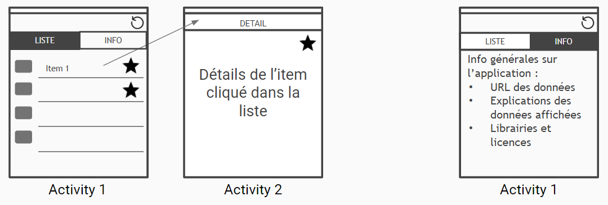
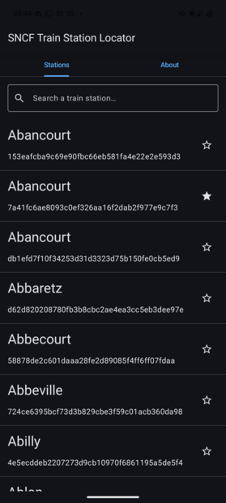
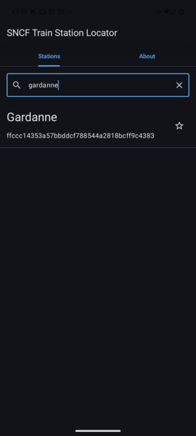
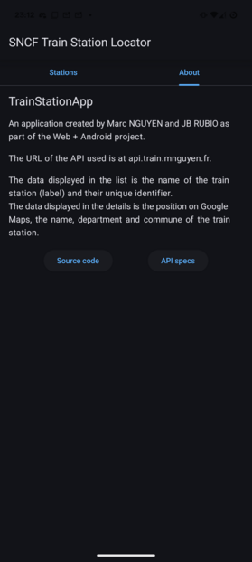
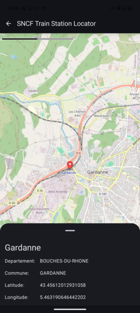
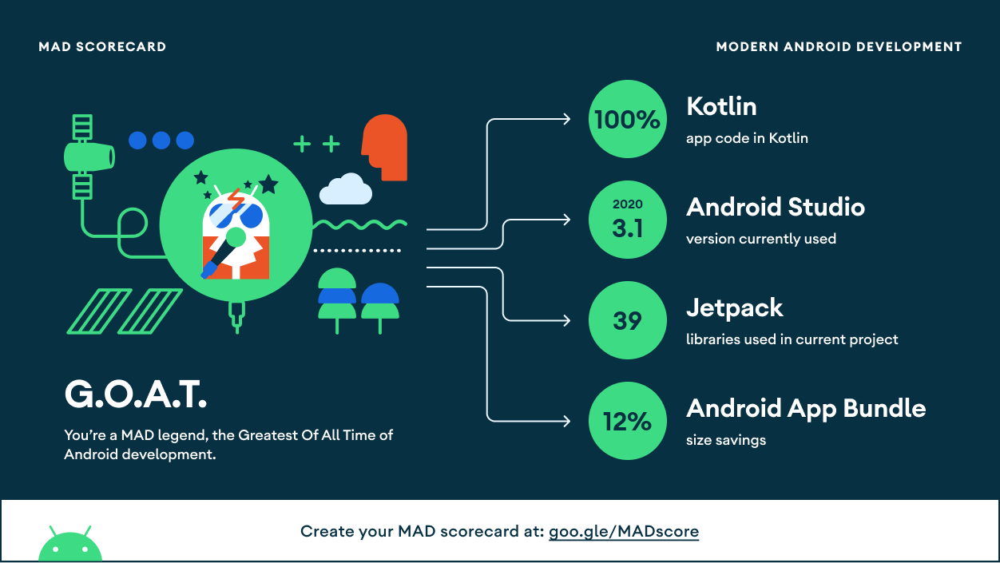
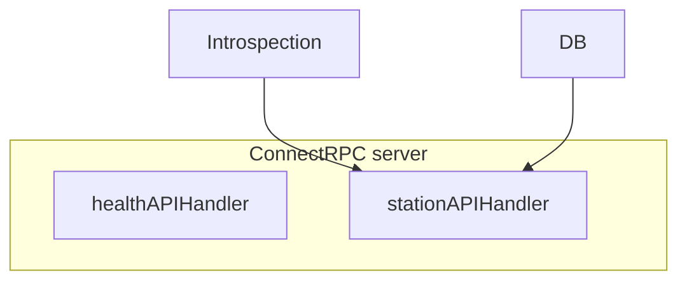
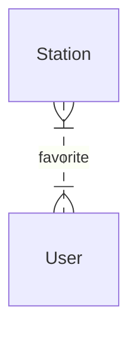
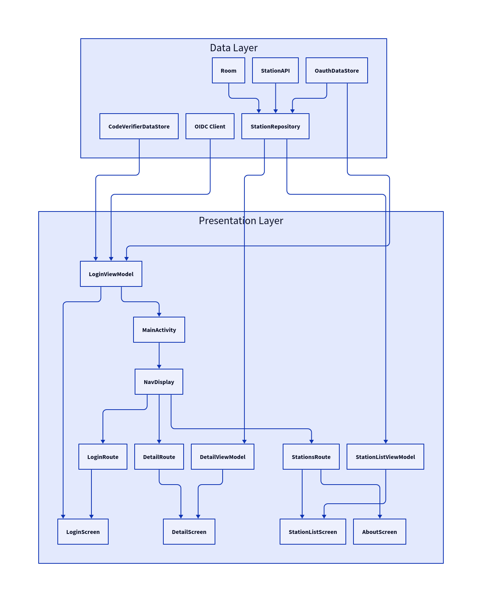

# Train Station

By Marc Nguyen and Jean-Baptiste Rubio.

## Specifications

### API

Specifications are given here: [Protos](./protos) and [`docs`](./docs)

### Android

- Fetch data from the api and display in a list and a screen with the details
- Possibility to bookmark certain items per user
- OAuth Authentication
- Mockup:
  
- Implementation of a search/filter system on the displayed list
- Setting up a local database to display the item list in offline mode
- Usage of StateFlow

## Screenshots

 
 

# Modern Android Development (MAD)

[MAD scorecard](https://madscorecard.withgoogle.com/scorecard/share/4258311558/)



# Documentation

## API

### Setup

#### Production build and deployment

1. Deploy an identity provider (like Dex):

   ```yaml
   # dex.config.yaml
   # TODO: for production, set this to the public URL of the auth server
   issuer: http://dex.example.com:5556

   # TODO: for production, change this
   storage:
     type: memory
   web:
     http: 0.0.0.0:5556
   telemetry:
     http: 0.0.0.0:5558

   # Configuration for static clients
   staticClients:
     # Used for login using server-side logic
     - id: train-station
       redirectURIs:
         # TODO: for production, change this to the public URL of the front end
         - 'http://train.example.com:5173/auth/callback'
       name: 'Train Station'
       secret: zYXYZSgEba6usrvj6lsjX5zQHEwaEi6mVbC5ulAlJ7zyV5QMzEdRYNoPZJnparTs
       public: false
     # Used for introspection
     - id: train-station-api
       name: 'Train Station API'
       secret: xo72oHz1Re11Clz7jHbtWjaILQzqOSNK3WLmsAnBug2YazxdqXRdhtPyhgdBRBIY
       public: false
     # Used for login using client-side logic
     - id: train-station-app
       redirectURIs:
         - com.example.trainstationapp://oauth2
       name: Train Station App
       public: true

   enablePasswordDB: true

   staticPasswords:
     - email: 'admin@example.com'
       # bcrypted "password"
       hash: '$2b$12$acCCsOuwI09Lg81y5A/w2egiCLcPu934ct4TAgBHgzfahut.9Oir6'
       username: 'admin'
       userID: '08a515ad-1111-2222-3333-1234567890ab'
   ```

2. Setup the environment variables in the `.env` file for the API:

   ```shell
   # LISTEN_ADDRESS=:3000
   # TLS_KEY=
   # TLS_CERT=
   # TLS_CLIENT_CA=

   INTROSPECTION_CLIENT_SECRET=xo72oHz1Re11Clz7jHbtWjaILQzqOSNK3WLmsAnBug2YazxdqXRdhtPyhgdBRBIY
   INTROSPECTION_CLIENT_ID=train-station-api
   INTROSPECTION_URL=http://dex.example.com:5556/token/introspect
   # INTROSPECTION_CACHE_PERIOD
   ```

3. Then, deploy the app:

   ```yaml
   services:
     init-permissions:
       image: registry-1.docker.io/library/busybox:1.37.0-uclibc
       volumes:
         - store:/data
       entrypoint: ['sh', '-c']
       command:
         - chown -R 1000:1000 /data && chmod -R 700 /data

     train-station-api:
       build:
         context: .
         dockerfile: Dockerfile
       user: '1000:1000'
       ports:
         - '3000:3000'
       env_file:
         - .env
       environment:
         - DB_PATH=/data/db.sqlite3
       volumes:
         - store:/data
       depends_on:
         init-permissions:
           condition: service_completed_successfully

     dex:
       image: ghcr.io/dexidp/dex:latest
       ports:
         - '5556:5556'
       command: dex serve /etc/dex/config.yaml
       volumes:
         - ./dex.config.yaml:/etc/dex/config.yaml

   volumes:
     store:
   ```

4. Run the app:

   ```sh
   docker compose up -d
   ```

#### Setup a development environment

Just use docker-compose to deploy the development environment:

```sh
cd /go
docker compose up -d --build
```

### Architecture


```mermaid
flowchart TD
  subgraph server[ConnectRPC server]
      healthAPIHandler
      stationAPIHandler
  end
  Introspection --> stationAPIHandler
  DB --> stationAPIHandler
```

- DB is filled on init.
- `healthAPIHandler` is used to check the health of the server.
- `stationAPIHandler` is used to manage the stations (set favorite, get many,
  etc.)
- `introspection` is used to introspect incoming JWT token, and to check if the
  token is valid.

Since we use introspection, we do not use JWKS to check if the token is valid.

### Entity relationship


```mermaid
erDiagram
    Station }|..|{ User : favorite
```

### Technologies used

- sqlc for database-first approach and type-safe SQL
- DIY solution for database migrations
- ConnectRPC as HTTP server and main entrypoint
- urfave/cli for the CLI tooling
- [OAuth Token
  Introspection](https://datatracker.ietf.org/doc/draft-ietf-oauth-jwt-introspection-response/12/)
  for Authentication

## Web Front-End

### Setup

Start the backend:

```shell
cd ./go
docker compose up -d
```

Install [bun](https://bun.sh) and install the dependencies:

```shell
bun install --frozen-lockfile
bun run dev
```

### Technologies used

- SvelteKit with SSR as main web framework
- OIDC Authentication
- protobuf-es + ConnectRPC as transport
- ViteJS for bundling and optimizing
- MapLibre for map rendering

## Android App

### Architecture

<!--

d2 code:

direction: down

data: Data Layer {
  CodeVerifierDataStore
  oidcClient: OIDC Client
  Room -> StationRepository
  StationAPI -> StationRepository
  OauthDataStore -> StationRepository
}

presentation: Presentation Layer {
  LoginViewModel -> MainActivity
  LoginViewModel -> LoginScreen
  NavDisplay -> LoginRoute
  LoginRoute -> LoginScreen

  NavDisplay -> DetailRoute
  DetailRoute -> DetailScreen
  DetailViewModel -> DetailScreen

  StationsRoute -> StationListScreen
  StationListViewModel -> StationListScreen

  MainActivity -> NavDisplay
  NavDisplay -> StationsRoute

  StationsRoute -> AboutScreen
}

data.StationRepository -> presentation.DetailViewModel
data.StationRepository -> presentation.StationListViewModel
data.CodeVerifierDataStore -> presentation.LoginViewModel
data.oidcClient -> presentation.LoginViewModel
data.OauthDataStore -> presentation.LoginViewModel


-->



The **Data** layer:

- The Data layer runs under Kotlin Coroutines and Kotlin Flow.
- _Room_ and the _DataStores_ is the application's cache
  - The cache temporarily stores the `Stations`
  - The cache is observable using Kotlin Flow
  - _Room_ is able to provide a
    [`PagingSource`](https://developer.android.com/reference/kotlin/androidx/paging/PagingSource).
    The `PagingSource` is able to load pages of data stored in a
    [`PagingData`](https://developer.android.com/reference/kotlin/androidx/paging/PagingData).
  - _Room_ executes requests in a Kotlin coroutine in the [IO
    thread](https://kotlin.github.io/kotlinx.coroutines/kotlinx-coroutines-core/kotlinx.coroutines/-dispatchers/-i-o.html).
- _StationAPI_ is a ConnectRPC data source which permits to retrieves
  `Stations`. It needs a JWT token to fetch datas.
- _OIDC Client_ uses the OAuth2 Authorization Code Flow with PKCE to fetch an
  access token. To avoid losing the code verifier from the PKCE flow, the code
  verifier is stored in the `codeVerifierDataStore`. The access token is cached inside the `oauthDataStore`.
- The `StationRepository` and executes CRUD methods.
  - For asynchronous actions, the `Station` of the response is cached and
    returned.
  - For a watch action (`watch`/`watchOne`), we observe the cache and may fetch
    the initial values from a data source.
  - For paged data, we create and run the
    [`Pager`](https://developer.android.com/reference/kotlin/androidx/paging/Pager)
    to **retrieve the `PagingData` from the cache.** The pager uses the
    `StationRemoteMediator` which is responsible to fetch and cache pages of
    `Station` from a data source.

In the **Domain** layer:

- Entities and contracts are defined here.
- Currently, our `stationRepository` satisfies most use cases (displaying a list
  of `Stations`, displaying details of a `Station`, updating a `Station`...).

In the **Presentation** layer :

- Data is observable in the `ViewModels`. The `ViewModels` act as the middle man
  between the presentation layer and domain layer. This is to follow the
  **[Modern Android App
  Architecture](https://developer.android.com/topic/architecture)**.
- The `MainActivity` renders a `Scaffold` with its `TopAppBar`. Inside that
  scaffold is a `NavigationHost` composable.
- The `NavigationHost` renders a page based on a route:
  - The default route is `/login`, and shows a login button. The button triggers
    a redirection to the OAuth provider, which then send the resulting OAuth
    Access Token to the `MainActivity` and triggers the `authAPI` to fetch a
    JWT. Upon receiving a JWT, the user is authenticated and is redirected to
    the `/stations` route.
  - The `/stations` route shows a `LazyColumn` which listen to a
    `Flow<PagingData<Station>>`. This allows lazy loading of the data, and
    therefore, the lazy loading of "station cards". The page also shows a
    "About" page. When the user push on a "station card", the user is redirected
    to the `/details` route.
  - The `/details` route shows the position of the train station on Google Maps
    and details about that station on a Bottom Sheet.

### Technologies used

#### Android dependencies and AndroidX

- Room and Protobuf DataStore, as a cache.
- Retrofit + OkHttp 4 + ConnectRPC, as data sources.
- Jetpack Compose, for bidirectional data binding and UI development.
- ViewModel and StateFlow, to follow the Modern Android App Architecture and
  avoid fragment/activities lifecycle issues
- Paging 3, as a solution for paged data
- Hilt, for dependency injection
- MapLibre for map rendering

#### Kotlin in general

- Kotlin Coroutines + Kotlin Flow, for async
- Kotlinx.serialization, for JSON serialization

# LICENSE

```
MIT License

Copyright (c) 2026 Marc NGUYEN, Jean-Baptiste RUBIO

Permission is hereby granted, free of charge, to any person obtaining a copy
of this software and associated documentation files (the "Software"), to deal
in the Software without restriction, including without limitation the rights
to use, copy, modify, merge, publish, distribute, sublicense, and/or sell
copies of the Software, and to permit persons to whom the Software is
furnished to do so, subject to the following conditions:

The above copyright notice and this permission notice shall be included in all
copies or substantial portions of the Software.

THE SOFTWARE IS PROVIDED "AS IS", WITHOUT WARRANTY OF ANY KIND, EXPRESS OR
IMPLIED, INCLUDING BUT NOT LIMITED TO THE WARRANTIES OF MERCHANTABILITY,
FITNESS FOR A PARTICULAR PURPOSE AND NONINFRINGEMENT. IN NO EVENT SHALL THE
AUTHORS OR COPYRIGHT HOLDERS BE LIABLE FOR ANY CLAIM, DAMAGES OR OTHER
LIABILITY, WHETHER IN AN ACTION OF CONTRACT, TORT OR OTHERWISE, ARISING FROM,
OUT OF OR IN CONNECTION WITH THE SOFTWARE OR THE USE OR OTHER DEALINGS IN THE
SOFTWARE.
```
